# Android Client Guide – MailSnap Mobile App

> **Important:** Before using the Android app, make sure all backend services are running via Docker as explained in [environment-setup.md](environment-setup.md).

The MailSnap Android app provides a full-featured mobile email experience, including secure login, inbox management, composing emails, spam detection, dark mode, and label organization – all with a native Android interface.

---

## Authentication Flow

The app opens directly on the **Sign-In screen**. New users can choose **Create account** to register.

### Create Account

To register, users must fill in the following fields:

- First name & Last name  
- Birth date (format: YYYY-MM-DD)  
- Gender  
- Email (must be `@mailsnap.com`)  
- Password + confirmation  
- Optional: Profile image upload

  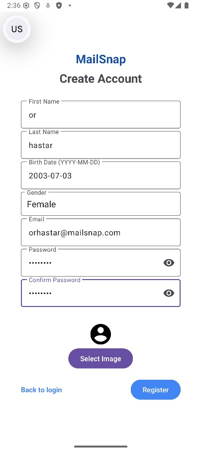

---

### Sign-In Flow

The login is divided into two steps:

| Step 1 – Enter Email | Step 2 – Enter Password |
|----------------------|-------------------------|
| 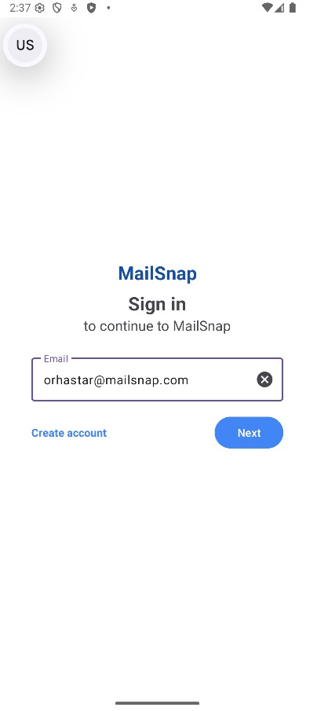 | 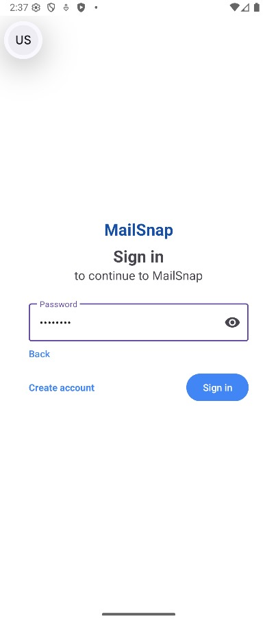 |

Once logged in, users are redirected to the Inbox screen.

---

### Logout

To log out:

1. Tap the profile icon in the top bar.
2. Select **"Logout"** from the menu.

  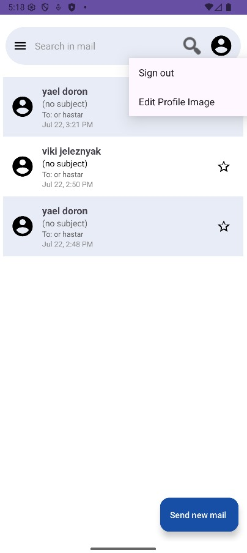

---

## Email Actions – Compose and Send 

When sending an email in the MailSnap Android app, the user can specify recipients, subject, and content.

- To send an email to **multiple recipients**, separate each email address with a comma (`,`).  
  Example:  
  `vikijeleznyak@mailsnap.com, yaeldoron@mailsnap.com`

| Inbox View                                       | Compose Mail (multiple recipients)                      |
|--------------------------------------------------|---------------------------------------------------------|
| 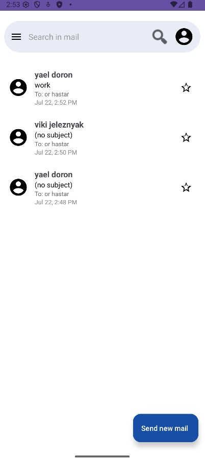               | 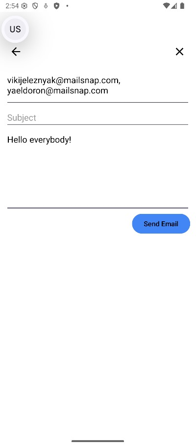                  |
| List of received/sent emails, showing sender, subject, and timestamp | New email composition screen – supports multiple recipients via comma |

> Once sent, the email will appear in the inbox of **each recipient**.

---

## Drafts – Save and Resume Later 

If the user closes the **Compose Mail** screen by tapping the ❌ icon instead of sending the email –  
the message is **automatically saved as a draft**.

To access drafts:

1. Open the sidebar menu (☰)
2. Tap on **Drafts**
3. Select a draft to resume editing or send it later

| Create Draft (Close Compose)                     | Navigate to Drafts                              | View Drafts List                          |
|--------------------------------------------------|--------------------------------------------------|-------------------------------------------|
| 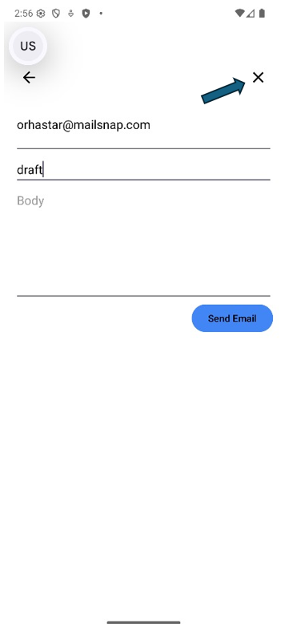 | 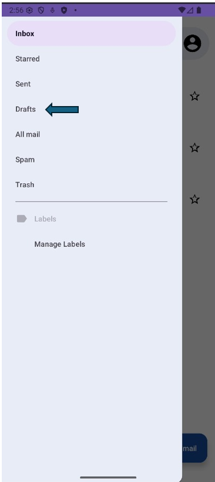  | 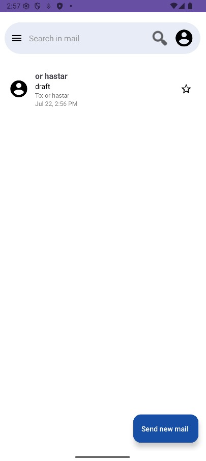    |
| Tap ❌ to close without sending – saves as draft | Open the sidebar and tap "Drafts"               | Drafted emails are listed with subject & recipients |

> Drafts are saved locally and can be sent anytime later by re-opening and tapping **Send**.

---

## Mail Actions – Delete / Spam / Label

When viewing a single email, you can perform the following actions using the top-right icons:

| Icon                  | Action                          |
|-----------------------|----------------------------------|
| 🗑️ (Green Arrow)      | **Delete** – moves the email to the Trash folder |
| ⚠️ (Red Arrow)        | **Report as Spam** – marks the email as spam and reports its URLs |
| 🏷️ (Blue Arrow)       | **Assign Label** – opens the label selector to categorize the email |

> These actions are only available from inside the individual mail view.

| Mail View with Action Icons                         |
|-----------------------------------------------------|
| 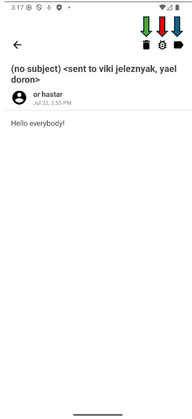        |

---

### Label Management

You can create, edit, and delete custom labels. These labels will appear in the sidebar and can be used to organize your mails.

- To access label management, click **"Manage Labels"** at the bottom of the sidebar.
- To **add a label**, enter a name and click **Add**.
- To **edit a label**, click the ✏️ (pencil) icon next to it.
- To **delete a label**, click the 🗑️ (trash) icon next to it.
- The updated labels will appear in the sidebar.
- When assigning a label to a mail, you will be able to choose from the updated list.

| Manage Labels | Add Label | Edit Label |
|---------------|-----------|------------|
|  |  | 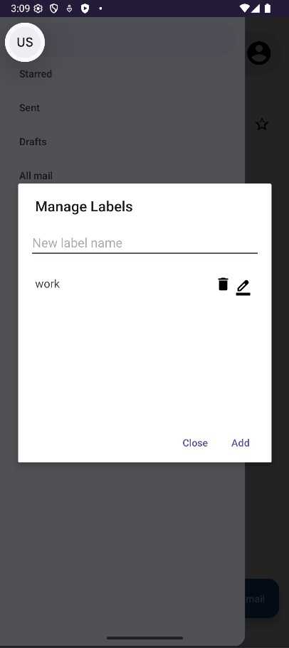 |

| Finish Edit | Updated Labels   | Sidebar View   |
|-------------|------------------|----------------|
| 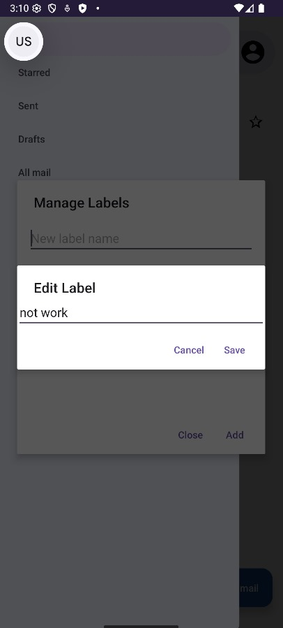 | 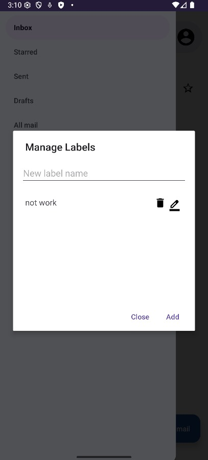 | 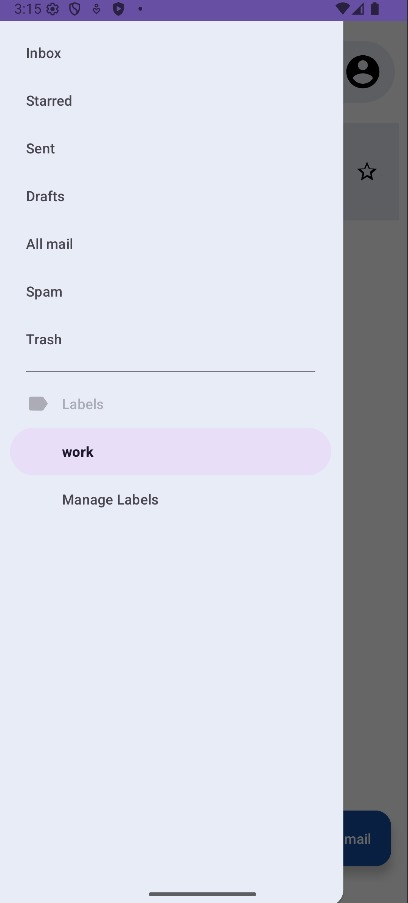 |

---

### Dark Mode Support

The MailSnap Android app supports **Dark Mode** for a comfortable experience.

To activate dark mode:

1. Go to your **device settings**
2. Navigate to **Display & touch**
3. Enable the **Dark theme** toggle

| Open Display Settings | Enable Dark Theme |
|------------------------|-------------------|
| 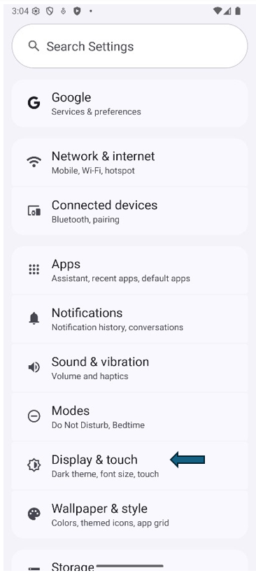 | 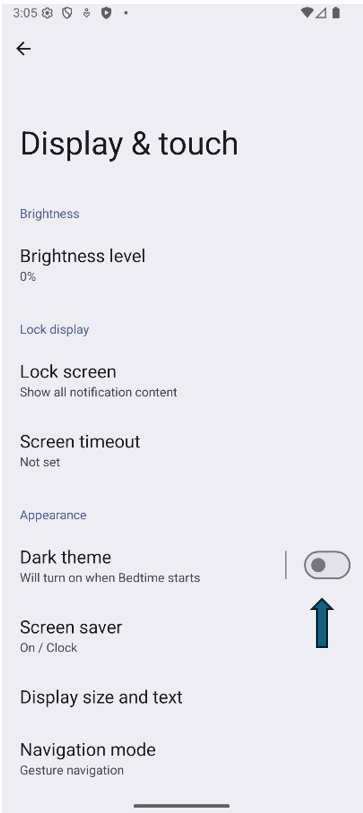 |

Once enabled, the MailSnap app will automatically adjust its UI to dark mode:

| Inbox (Dark Mode) | Sidebar (Dark Mode) |
|--------------------|---------------------|
| 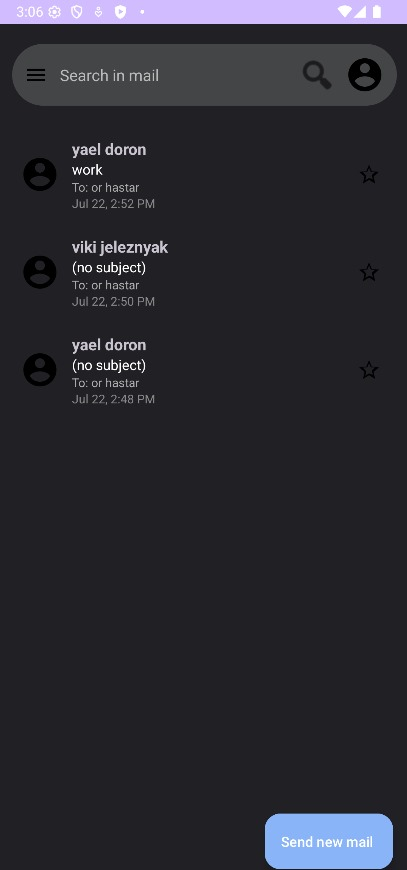 | 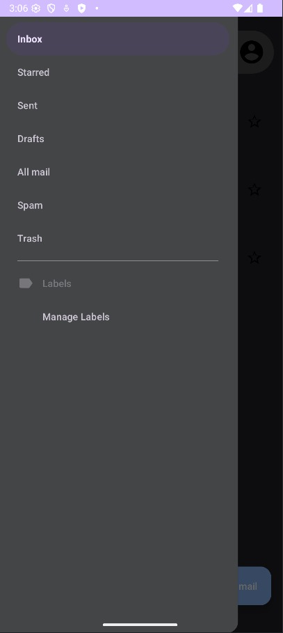 |

