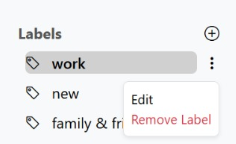

# Web Client Guide – MailSnap React App

> **Important:** Before using the Web client, make sure you have followed the instructions in [environment-setup.md](environment-setup.md) and started all backend services with Docker Compose.

MailSnap is a full-featured Gmail-like email client built in React. It includes a modern UI, secure authentication, labels, spam filtering, and more.

---

## User Interface Overview

| Inbox                             | Mail View                          | Compose                             |
|----------------------------------|------------------------------------|-------------------------------------|
|  |  |  |

---

## Authentication Flow

MailSnap uses JWT-based authentication to ensure secure access.

### Sign-Up Form

- Required fields:
  - First name & Last name
  - Birth date
  - Gender
  - Email (must be `@mailsnap.com`)
  - Password + Confirmation
- Optional: profile image upload

Example:

---

### Login Flow

| Step 1: Enter Email                        | Step 2: Enter Password                    |
|-------------------------------------------|-------------------------------------------|
|  |  |

Once logged in, you will be redirected to your inbox and can begin using all email features.

### Logout

To log out of the system:

1. Click on your profile image at the top-right corner.
2. In the dropdown menu, click **"Sign out"**.

> This action removes the JWT from localStorage and redirects you to the login screen.

  

---

## Email Actions – Compose / Edit / Delete

### Compose and Send

1. Click **"Compose"**
2. Fill in:
   - Recipient (must be another MailSnap user)
   - Subject
   - Email content
3. Click **Send**

If you close the window instead of sending → the email is saved as a **draft**.

---

### Edit a Draft

1. Go to the **Drafts** section
2. Click on the draft you want to continue
3. Modify the content and send it when ready

---

### Delete Email

1. Select one or more emails (using checkboxes)
2. Click the **Trash icon** in the action bar
3. The email moves to the **Trash** folder  
   - It can be **restored** later  
   - It will be **permanently deleted after 30 days**

---

## Labels Managemant

- You can **create**, **assign**, **edit**, and **remove labels** to organize your emails.
- To assign a label:
  1. Select emails
  2. Click the **Label icon**
  3. Choose or create a new label

  You can edit an existing label by clicking the three-dot menu next to it and selecting "Edit".

| Before Editing                            | Edit Dialog                              | After Editing                            |
|-------------------------------------------|-------------------------------------------|-------------------------------------------|
|      |  |        |

> Once saved, the label will update immediately in the sidebar and all associated emails will reflect the new label name.

---

## Dark Mode

Switch between light/dark mode using the toggle in the top-right corner.

| Light Mode                                 | Dark Mode                                 |
|--------------------------------------------|--------------------------------------------|
|  |  |

---

## Search Mails

- Use the search bar to filter emails by:
  - Subject
  - Content

---

## Additional Features

- Star / Unstar emails
- Mark as read / unread
- Restore from trash
- Spam detection via C++ Bloom Filter server:
  - When an email is marked as spam, all future emails containing the same links (URLs) will also be flagged automatically

---

### Sample Users

| Email                   | Password  |
|------------------------ |-----------|
| demo1@mailsnap.com      | 12345678  |
| demo2@mailsnap.com      | ms37d19A  |

### Working with Multiple Users

To test the app with two users at the same time, open it in a regular browser window for one user, and in an Incognito (private) window for the second user.